В данном тексте представлен анализ конкурентов для некоторой крупной
сети пиццерий, локализованной главным образом в России и ближайшем
зарубежье, основанный на специфике города Томска. Будут описаны
преимущества и недостатки конкурентных решений, а также минимальный
набор функций для нашего проекта.

# Оглавление

[**Оглавление** **1**](#оглавление)

[**Отбор конкурентов** **1**](#отбор-конкурентов)

[**Додо Пицца** **4**](#додо-пицца)

[**Make Love Pizza** **8**](#make-love-pizza)

[**Функционал нашего продукта** **12**](#функционал-нашего-продукта)

# Отбор конкурентов

Конкуренты были отобраны следующим образом:

1.  На 2ГИС для Томска пиццерии были отсортированы по рейтингу;

2.  Были отобраны первые 3, исключая сети масштабом меньше
    международного (впрочем, все остальные были собраны на одном и том
    же конструкторе и выглядели одинаково).

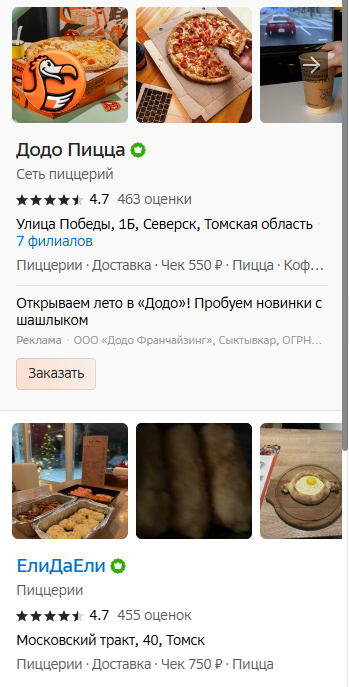{width="2.557292213473316in"
height="5.007584208223972in"}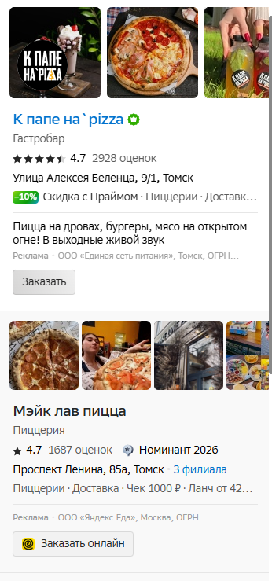{width="2.398337707786527in"
height="5.122849956255468in"}

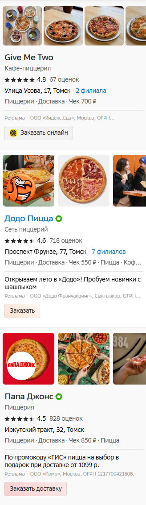{width="2.2552088801399823in"
height="7.783753280839895in"}

# Додо Пицца

Минусы:

- Кэшбэк-программа Додокоины представлена только в мобильном
  приложении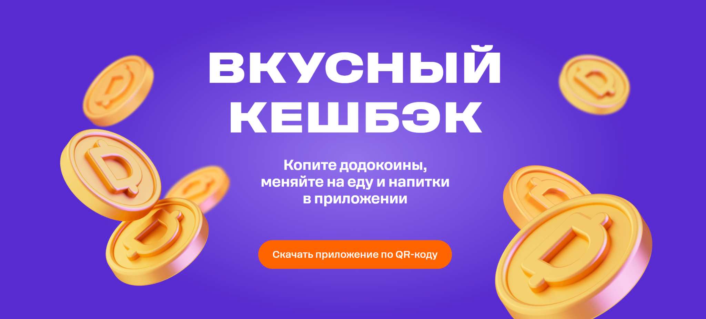{width="6.267716535433071in"
  height="2.8333333333333335in"}

Понятно, что тем самым Додо мягко заставляет клиентов скачивать
мобильное приложение. В то же время для клиента это может вызвать
большое неудобство: банально телефон может не быть под рукой, могут быть
проблемы с мобильной связью или устройством, тогда воспользоваться
кэшбэком не получится, а кэшбэк-программы в наше время - один из важных
факторов, по которым люди выбирают фастфуд.

- Стоимость доставки
  непрозрачна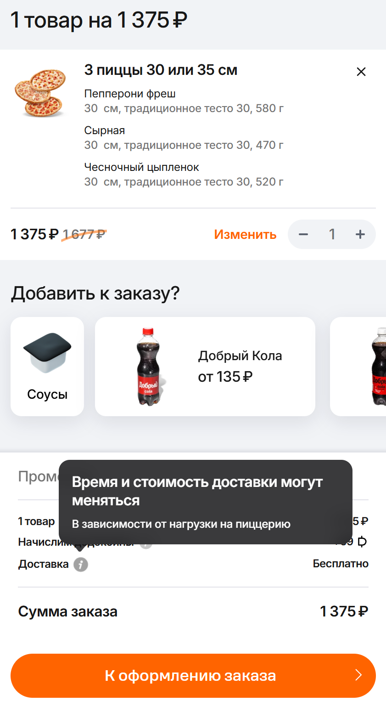{width="2.2301246719160104in"
  height="4.0434033245844265in"}

В данном заказе доставка бесплатна. Но что, если я хочу заказать
доставку пиццы на мероприятие через несколько дней и стоимость доставки
мне надо узнать сейчас? Неоднозначная формулировка "Время и стоимость
могут меняться в зависимости от нагрузки" не дает никакой полезной
информации клиенту.

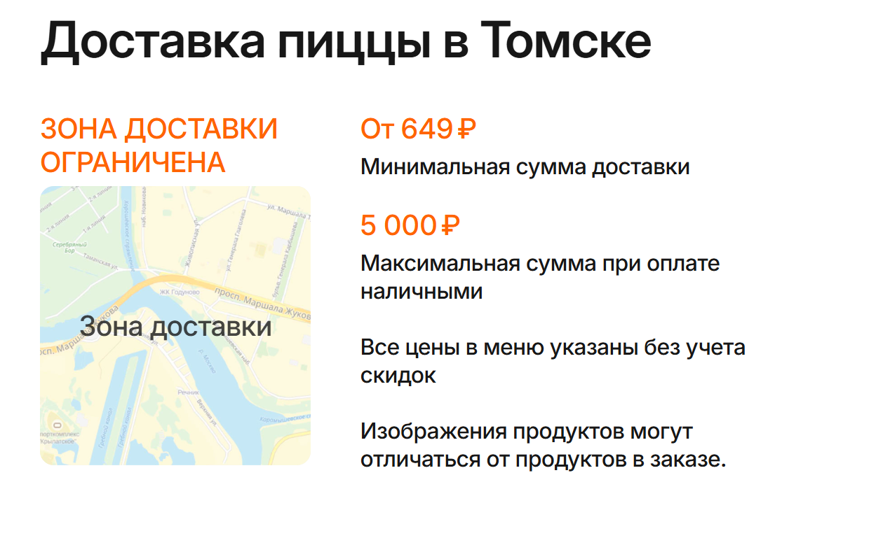{width="4.869792213473316in"
height="3.0603182414698162in"}

На самом деле, эта информация есть на сайте, но находится в самом низу
сайта. Намного вероятнее, что клиент увидит информацию о стоимости в
корзине и сделает вывод, что информация непрозрачна, чем то, что он
дойдет до самого конца сайта.

- Во время оформления заказа нельзя увидеть КБЖУ

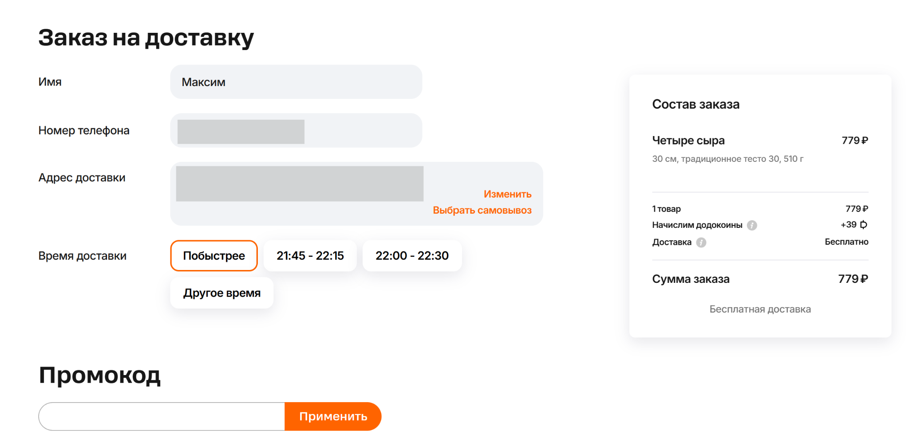{width="6.267716535433071in"
height="3.0555555555555554in"}

Во время заказа нет кнопки, чтобы увидеть КБЖУ, хотя она есть в меню и в
корзине.

Плюсы:

- Удобное меню по
  блокам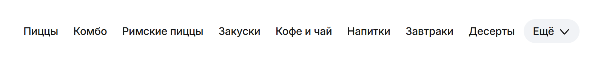{width="6.267716535433071in"
  height="0.7083333333333334in"}

Удобная понятная навигация по категориям

- Прямой эфир с
  кухни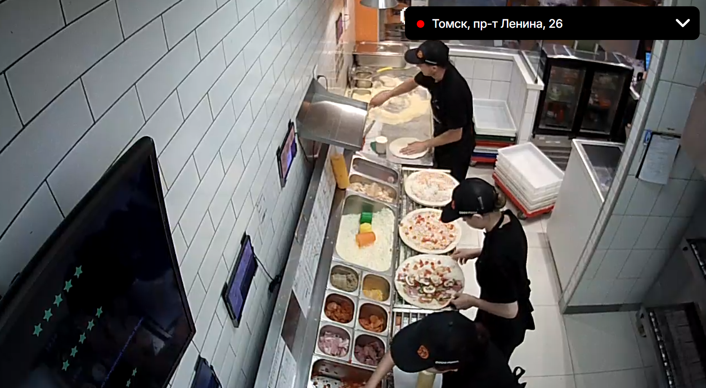{width="6.267716535433071in"
  height="3.4444444444444446in"}

Эта фича не приносит никакой пользы клиенту напрямую, но значительно
повышает доверие к сети, ведь им "скрывать нечего".

- Наглядное сравнение разных диаметров
  пиццы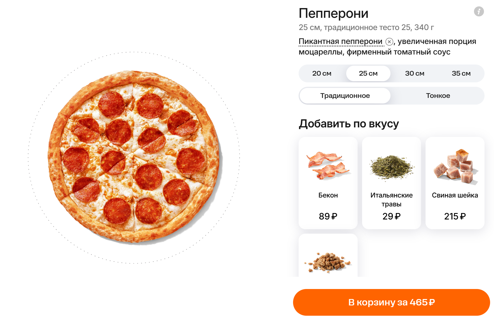{width="6.267716535433071in"
  height="4.069444444444445in"}

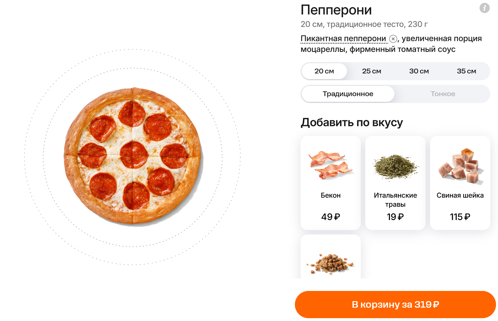{width="6.267716535433071in"
height="4.041666666666667in"}

На сайте представлено наглядное сравнение разных диаметров пиццы, легко
сравнить и выбрать нужный товар.

Итог

Додо Пицца - крупнейшая сеть пиццерий в РФ с очень хорошо отлаженным
механизмом. Она понятна и доступна всем слоям населения: молодежи,
семьям с детьми, старшему поколению и т.д, что делает ее невероятно
прибыльной.

По части комфорта и удобства клиента, ориентированности на максимально
широкую аудиторию - однозначно хороший пример, на который можно
ориентироваться.

# Make Love Pizza

Минусы:

- Непонятная навигация по меню

минус::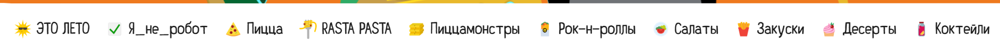{width="6.267716535433071in"
height="0.3333333333333333in"}

Данная навигация - первое, что встречает клиента на сайте. Едва ли
пользователь, зашедший на сайт впервые, поймет, что "Это лето" -
сезонное меню, "Я не робот" - скидки, а "Пиццамонстры" - наборы пицц.
Даже эмоджи не во всех случаях проясняют ситуацию, из-за чего клиенту
приходится сперва пролистать меню полностью, чтобы понять, какие вообще
есть категории.

- Навигация по меню перекрывает дизайн баннера и сливается с некоторыми
  баннерами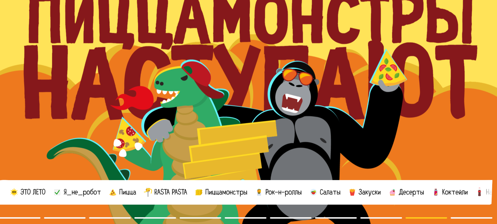{width="6.267716535433071in"
  height="2.8333333333333335in"}

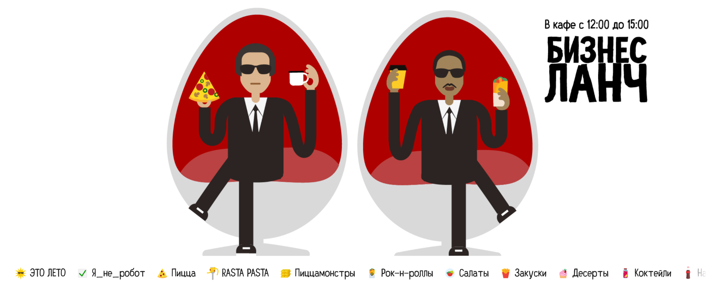{width="6.267716535433071in"
height="2.638888888888889in"}

Навигация перекрывает часть баннера. На баннере с белой заливкой
навигация вообще не выделяется, и пользователь может по ошибке нажать на
кликабельный баннер, хотя ему могла быть нужна категория из навигации,
или наоборот.

- В корзине нельзя посмотреть КБЖУ

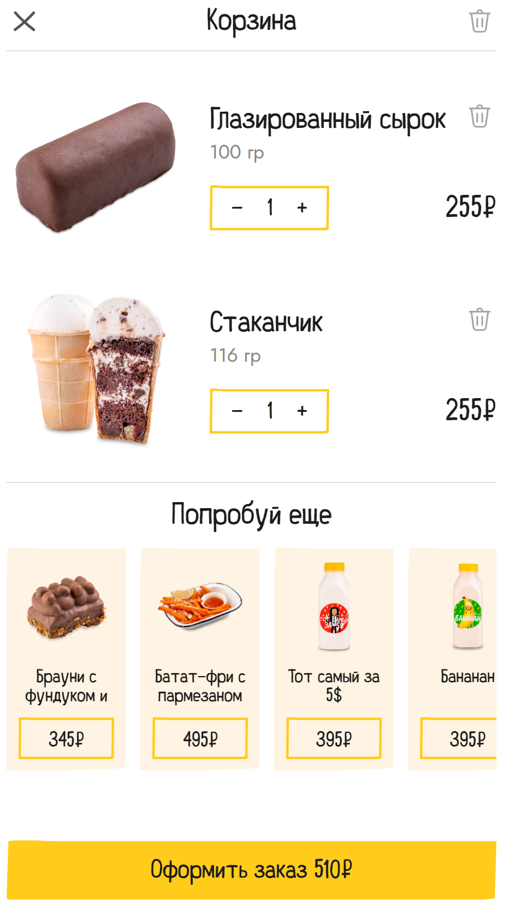{width="3.057292213473316in"
height="5.386167979002624in"}

КБЖУ доступно только в меню, в корзине или на странице оформления заказа
увидеть его уже нельзя.

Плюсы:

- Наглядное меню

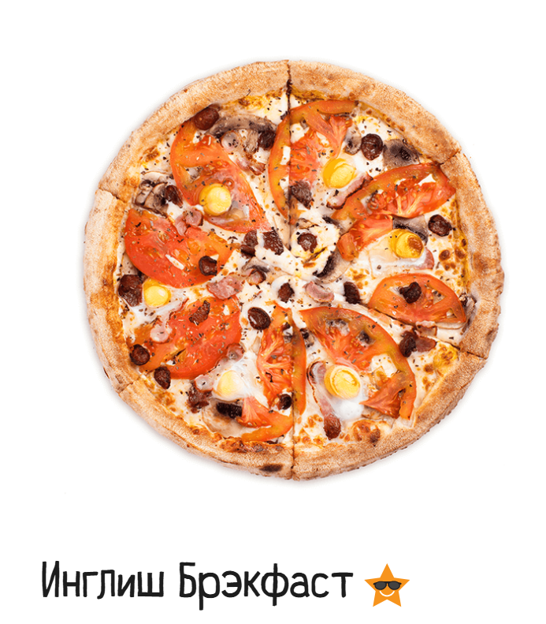{width="2.794358048993876in"
height="3.180716316710411in"}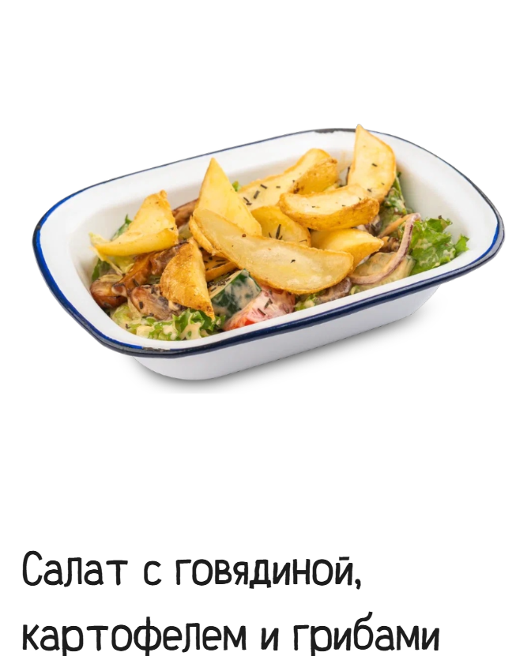{width="2.4739588801399823in"
height="3.0798261154855644in"}

При одном взгляде на любую позицию в меню сразу понятно, из чего состоит
блюдо. Все фотографии яркие, наглядные и очень привлекательные.

- Выделяющийся дизайн, направленный на молодую
  аудиторию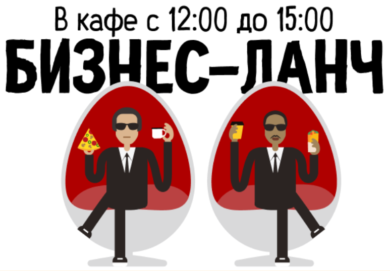{width="4.401630577427822in"
  height="3.063593613298338in"}{width="5.546875546806649in"
  height="3.0498600174978128in"}

Сеть позиционирует себя как молодежную, полную поп-культурных отсылок.
Дизайн сайта отлично дополняет этот образ пиццерии, привлекая молодую
аудиторию не только едой, удобством и акциями, но и ощущением чего-то
большего, чем просто пиццерия.

Итог

Make Love Pizza - относительно небольшая сеть, но она имеет преданную
аудиторию благодаря креативному подходу к оформлению и позиционированию,
популярной сейчас "нишевости".

# Функционал нашего продукта

На основании анализа успешных конкурентов был выделен минимальный набор
функций, который должен присутствовать в нашем проекте.

- Создание аккаунта;

- Корзина;

- Оформление заказа и доставки;

- Навигация по меню;

- Страница каждого блюда с подробной информацией

Есть и функции, которые выгодно выделят нашу сеть на фоне конкурентов:

- Отслеживание заказа на сайте, не только в мобильном приложении;

- Информация о КБЖУ на любом этапе оформления заказа (тренд на здоровое
  питание актуален как никогда);

- Визуальное отображение выбранных добавок и убранных ингредиентов
  (этого нет ни у одного описанного конкурента);

- Сортировка по ингредиентам (весьма актуально именно для пиццы, которая
  является по сути одним и тем же блюдом, но имеет десятки вариаций).

Итог

Даже у сверхприбыльных конкурентов легко выделить недостатки,
исправление которых (при сохранении сильных сторон) может привлечь
аудиторию к нашему проекту. Однако, очень важно заранее определиться,
планируем мы работать с широкой аудиторией или с "нишевой"
